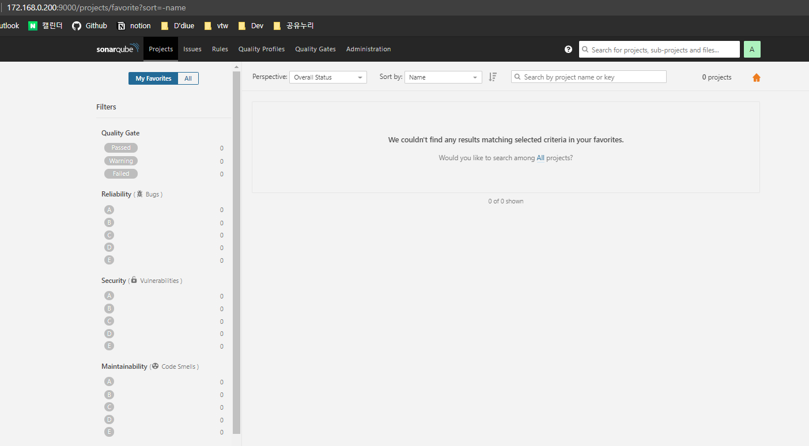

<br/><br/>

좋은 시스템에서 좋은 코드를 보고 배우며 성장하는 유토피아를 꿈꾸는 주니어였지만 , 현실은 하드코딩 난무하는 `레거시코드`와 `통계업무지옥`에 치이고 약간은 타성에 젖어가며... 저는 어느덧 2년 n개월차 주니어로 살고 있었습니다.😥
<br/>

그때 만난 [이글](https://sogoagain.github.io/2020/03/08/%EB%A0%88%EA%B1%B0%EC%8B%9C-%EC%BD%94%EB%93%9C%EB%A5%BC-%EC%A0%90%EC%A7%84%EC%A0%81%EC%9C%BC%EB%A1%9C-%EA%B0%9C%EC%84%A0%ED%95%9C-%EA%B2%BD%ED%97%98/)이 저에게 뭔가 `trigger`가 되었습니다! 글 내용 중 가장 와닿았던 부분은 

<br/>

> * 레거시 코드는 다른 사람이 "처음" 작성해야 하는 처지였음을 잊지 말아야 한다. 
> * 레거시 코드를 만난다고 실망에 그칠 것이 아닌 적극적으로 개선시키는 태도가 필요하다.

<br/>

라는 부분 이었습니다. 레거시 코드를 두고 투덜대기만 할 것이 아니라 저 스스로가 `적극적인 태도`를 가지고 개선하려는 마음 가짐을 갖게 하는 좋은 초석이 되었습니다. 저 조차도 6개월 전에 제가 쓴 코드를 보고도 '아니 이건 왜 이렇게 짰담?🤔' 하는 경우가 있었기 때문에(~~나만 그런거 아니라고 해줘...~~) 더욱 더 공감되는 부분이였습니다.
<br/>

그래서 지금 운영 유지보수로 업무하고 있는 프로젝트의 코드 개선을 위해 `SonarQube`를 도입한 경험을 공유합니다. 🕺💃
<br/><br/>

---
<br/>

## SonarQube Web 설정하기 

설치에 앞서 `SonarQube`를 도입한 환경은 프로젝트 개발서버(테스트서버)로 리눅스 RedHat 환경을 기준으로 작성하였습니다. 설치된 프로젝트는 *maven, gradle을 사용하지 않는 Spring 프로젝트 환경*임을 명시합니다.


우선, 소나큐브를 통해 코드 품질 분석을 하려면 `SonarQube`와 `SonarScanner` 그리고 `PostgresQL`이 필요합니다. 차례대로 설치하여 구동해봅시다!
<br/><br/>

### 1. PostgreSQL 설치

```shell
#postgresql 설치 
sudo apt-get install postgresql

#계정을 postgres로 변경 
su -u postgres

#postgresql 커맨드 실행
psql 
```
<br/>

```shell
#소나큐브 유저생성
CREATE USER sonar WITH ENCRYPTED PASSWORD 'sonar2020!!';

#DB생성
CREATE DATABASE sonar OWNER sonar;

#DB권한설정
ALTER ROLE sonar WITH CREATEDB;
GRANT ALL PRIVILGES ON DATABASE sonar TO sonar;

# 커맨드 종료(exit) 후 재시작
$ systemctl restart postgresql
```
<br/>

### 2. SonarQube 설치 
<br/>

홈페이지 [다운로드](https://www.sonarqube.org/downloads/) 페이지에서 소나큐브를 다운로드 받아 설치하여 봅시다. 이때 소나큐브를 사용하려면 서버에 `jdk`도 설치되어있어야 하니 `Open JDK 8`버전으로 미리 다운로드를 받아 두도록 합니다.

<br/>

```shell
#설치경로 (개인에게 맞는 경로로 사용하길 추천)
mkdir /opt/sonarqube

#SonarQube 다운로드
wget https://binaries.sonarsource.com/Distribution/sonarqube/sonarqube-7.2.1.zip

#압축 해제 
unzip sonarqube-7.2.1.zip

#파일 이동
mv sonarqube-7.2.1 /opt/sonarqube
```
<br/>

소나큐브가 설치된 경로에서 에디터를 사용하여 `sonar.properties`를 속성을 변경해봅시다!

```shell
#디렉토리 이동 
cd /opt/sonarqube/conf

#설정파일 변경 
vi sonar.properties
```
<br/>

`sonar.properties`에서 아래의 내용에 있는 `key`를 찾아 [1. PostgreSQL-설치](#1.-PostgreSQL-설치) 에서 설정한 대로 속성을 수정을 하시면 됩니다!
```
#### jdbc 설정
sonar.jdbc.username=sonar
sonar.jdbc.password=sonar
sonar.jdbc.url=jdbc:postgresql://localhost/sonar

#### WEB서버 설정
sonar.web.javaOpts=-Xmx3096m -Xms2048m -XX:+HeapDumpOnOutOfMemoryError
sonar.web.javaAdditionalOpts=-server

sonar.web.host=0.0.0.0
sonar.web.port=9000
#9001번 port는 소나큐브내부의 elastic search가 사용하므로 지양
```
<br/>

### 3. SonarQube 실행
<br/>

이제 기초 준비가 되었으면 소나큐브를 잘 설치되었는지 구동 커맨드를 실행해 봅니다.

```shell
#소나큐브 설치 경로 이동 
cd /opt/sonarqube/bin

#실행커맨드 
#(옵션 목록 : console | start | stop | restart | status | dump)
./sonar.sh start
```
<br/>

정상적으로 실행되었다면, [2. SonarQube 설치](#2.-SonarQube-설치)에 설정한 대로 웹콘솔은 `9000`번 포트에서 확인 할 수 있습니다. 타란~🙆‍♀️ 소나큐브의 초기 계정정보는 id와 pw 모두 `admin`을 사용중이니 **꼭!**  변경하여 사용하도록 합시다! 

(우측상단 프로필 클릭 > My Account > Security 탭에서 수정 가능)



<br/>

여기까지 소나큐브 설치 방법은 완료되었고, 프로젝트 등록 및 코드스캔에 대한 내용은 2편에서 이어서 금방 돌아오겠습니다💁‍♀️

<br/>

---
<br/>

### 참고

- sonarsource Community [https://community.sonarsource.com/](https://community.sonarsource.com/)
- sonarQube 설치하기 [https://info-lab.tistory.com/183](https://info-lab.tistory.com/183)
- PostgresQL 가이드북 [http://www.devkuma.com/books/pages/1459](http://www.devkuma.com/books/pages/1459)